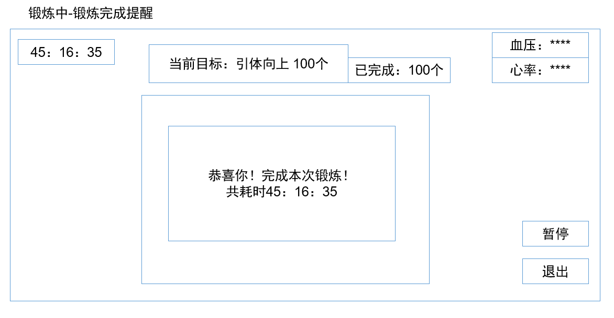

## Welcome to SEU-HCI Project: VR虚拟健身教练

### 问题

由于时间、金钱、疫情等因素，现在许多人选择在家中进行锻炼。而在居家锻炼中也需要一定的指导，人们往往使用手机上的健身应用来代替健身教练进行指导。但是现有的健身应用存在许多缺点。
首先，虽然健身应用对于动作配有视频演示，但是由于视频演示的拍摄角度固定，有时还是难以准确理解规范的动作。再者，健身者无法看见自己的动作，在动作出错时无法自己发现和纠正。所以健身的效果往往并不理想。

所以我们设计了“VR虚拟健身教练”这一软件，旨在为忙碌中而又想接收专业的健身指导的人们提供服务。

### 目标用户

有锻炼自身的意向而又缺乏时间和金钱的青年、中年群体。

### 解决方案

“VR虚拟健身教练”软件除了现有的健身app的功能之外，还可以为用户提供VR健身教练演示，以及动作纠正等功能。

对于在传统健身app的视频演示无法让人准确理解的问题，本软件使用VR或者MR技术，使得用户可以从各个角度看到虚拟健身教练的演示动作。并且虚拟健身教练可以对用户可以起到激励的效果。

本软件使用动作捕捉技术实现动作纠正功能，在用户动作错误时提醒用户并且提供相关信息。本软件支持基于传感器、深度摄像头等的多个动作捕捉方案。若用户没有动作捕捉设备也不影响前述功能的使用。

### 角色及任务

“VR虚拟健身教练”项目文档撰写：71119217陈奇烨，71119219涂祎乐

“VR虚拟健身教练”设计网站建立：71119214李孟泽，71119213龚凯杰

***

### 场景

1.设备佩戴检查

概述：健身开始前的检测设备是否佩戴完整并正确。当健身者准备开始进行健身锻炼时，设备首先会自动检测是否佩戴完整并且位置合理，VR会要求健身者进行一个深蹲操作来检测各个传感器是否正常工作，如果这些传感器的传回数据能够通过算法检测，则认为健身设备佩戴完整并且位置合理。
Goal：确定设备佩戴正确。
Precondition：用户打开应用。
Exception：如果健身设备佩戴出现问题，则提醒用户佩戴不正确，并给出佩戴建议。

2.运动计划

概述：在开始运动前，用户选择自定义或系统预设的运动健身方案或者单个的健身动作，进入运动。
Goal：用户确定运动计划。
Precondition：设备佩戴检查通过。

3.检查用户运动动作

概述：当VR佩戴者进行健身锻炼时，佩戴者身上的传感器会将数据实时传输至云端服务器，通过算法判断佩戴者的健身姿势是否标准。
Goal：确保用户动作准确。
Precondition：用户已选择运动计划。
subtask：4
Exception：如果佩戴者姿势出现略微偏差，则提醒佩戴者更正姿势。

4.虚拟健身教练演示

概述：在用户健身的同时会在VR显示设备虚拟健身教练演示健身动作，用户可以参照教练的动作进行健身。
Goal：应用为用户演示健身动作。
Precondition：用户已选择运动计划。
Exception：如果虚拟健身教练演示出现问题，则用户可以进行报错反馈。

5.用户运动记录
概述：在用户运动健身结束后，应用会记录下用户的运动健身数据。用户可以随时查看之前的运动记录。
Goal：用户记录
Precondition：用户已选择运动计划。
Exception：如果应用无法出现错误无法记录，则提示用户。

***

### 初步界面设计

 

 
第一种风格设计较能清晰地反映出用户的当前状态，虽然使用流程不如第二、第三种风格那么一目了然，但是它可以具体地展示用户的行为和系统的各种信息，对于用户来说比较方便和直观。

### 总体设计

### 故事板

一、 佩戴设备

二、 设备检测

健身开始前的检测设备是否佩戴完整：当健身者准备开始进行健身锻炼时，设备首先会自动检测是否佩戴完整，VR会要求健身者进行一个深蹲操作来检测各个传感器是否正常工作，如果这些传感器的传回数据能够通过算法检测，则认为健身设备佩戴完整。

经由这个的操作后，算法检测可以同样计算佩戴位置是否合理，如果健身者的佩戴位置不正确，将会报出提示和佩戴建议。

三、 选择套餐

在开始运动前，选择自定义或系统预设的运动套餐，进入运动，若不选择，则无法进入。

四、 开始锻炼

开始锻炼时，秒表会记录运动时间，在运动过程中，一直会显示已运动的时间和预计运动时间，在开始运动前，也会显示运动套餐预计的时间。

五、 检测锻炼姿势是否正确

1.健身姿势偏差提醒：当VR佩戴者进行健身锻炼时，佩戴者身上的传感器会将数据实时传输至云端服务器，通过算法判断佩戴者的健身姿势是否标准。若佩戴者姿势出现略微偏差，则提醒佩戴者更正姿势。若佩戴者多次更正姿势仍不满足要求，则定义为佩戴者个人体态问题，继续下一步骤。

2.健身姿势正确提醒：判断方式同上，若佩戴者姿势正确，则予以鼓励，继续下一步骤。

### 角色及任务

初步界面设计：71119217陈奇烨，71119213龚凯杰
总体设计：71119217陈奇烨，71119219涂祎乐，71119213龚凯杰，71119214李孟泽
故事板：71119214李孟泽，71119217陈奇烨